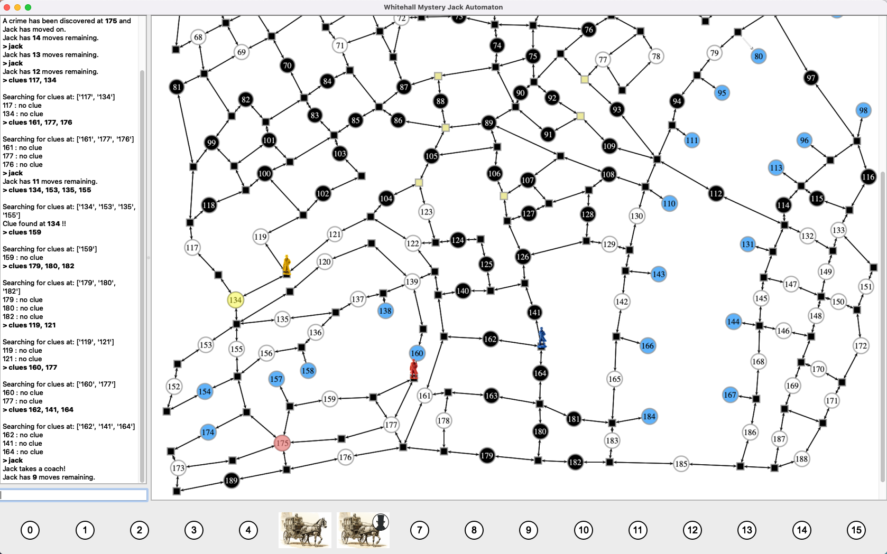

# Whitehall Mystery
Attempt at creating a computer player for Jack for the board game Whitehall Mystery

My board game group size is usually three people.   We really enjoy Whitehall Mystery, but wanted to all play investigators for a change.  Hence this project.  My main goal was to allow human players to play against a computerized Jack, initially via text entry commands specifying move actions, looking for clues, and performing arrests. A more distant goal is to perform moves via a graphical interface.

NOTE: This requires the python [graph-tool](https://graph-tool.skewed.de/static/doc/index.html), and [pyqtree](https://pypi.org/project/Pyqtree/) library.

CAVEAT: This is still a work-in-progress.  I have transcribed the map into di-graph form and Jack is playable. The use of special cards still needs some refinement.

To start, run `whitehall_gui.py`.   Assuming you have the graph-tool package installed, you should be presented with a fullscreen UI with the command-line-interface on the left and a graph view of the map state on the right.   Commands are entered in the small entry window on the lower left.

Type `help` at the prompt to get a full list of commands.  

**Please note**: rules enforcement is assumed to be performed by the players.  Other than validating locations actually exist, there is no enforcement of where an investigator can move nor where clues or arrests can be mode.   However, when searching for clues using the `clues` command, if you provide a list, it will stop searching as soon as a clue is found, per the rules.  So, if Jack had visited locations 52 and 53, typing `clues 52, 53, 55` would only reveal a clue was found at 52.  But, the game will not check if the investigator were close enough to actually perform a clue search.  The players must ensure they enter legal searchs.  A future enhancement will add more rules enforcement for the players.

To the best of my knowledge Jack always plays by the rules.  If you notice incorrect behavior for Jack, please let me know.

If you want to see in detail what Jack is doing, you can enable "godmode" which is helpful for debugging and other diagnostics. When in godmode, you can move Jack to an arbitrary location to test behavior. **Enabling godmode will completely spoil the challenge of the active game. You will see Jack's path on the map as well as a transcription of where he is heading.** Use godmode only if you are curious how the Jack behavior works or are debugging the code.

## About the artwork
All artwork used in this program has been created from scratch.  In respect of Fantasy Flight Games copyrights, no images have been copied from the original game materials. 

## Theory of operation
A di-graph was needed so a weight can be assigned to ingress edges to a location, but not to outbound edges.  This allows path distance calculation to ignore the cost of crossings, since Jack goes from location to location.  However, it also will allow the graph to be updated with weights in crossings based on the players' positions so when a "best" path is chosen, investigators can be avoided.   Similarly, weights can be assigned to water crossings and alleys to influence how likely Jack will be to use them.

Having the map as a di-graph then allows standard graph theory algorithms (from [graph-tool](https://graph-tool.skewed.de/static/doc/index.html)) to be applied for aiding Jack in his behavior.  

The current investigator locations are "poisoned" with a high weight on the edges leading to/from them so Jack cannot path through them.  Also, a deterrent weight is added to all the edges radiating out from each investigator, encouraging Jack to not get too close to the investigators while Jack searches for a path to his target.  If Jack finds the shortest path cannot reach his goal within the number of moves left in the round, he will iteratively reduce the deterrent weight for the investigators until he gets a path that reaches the target before the 15 turns are up.   If Jack cannot reach *any* target given the number of turns left, he will forfeit the game.

Boats paths and alleys are also part of the di-graph, but are given higher weights (i.e. costs) to encourage Jack to only use them if there is a large benefit in distance gained.

If Jack is trapped, or if the investigators are very close to him, he will also consider using an alley or a coach.  Per the rules, a coach or alley cannot be used to reach the target, so the implementation attempts to take this into account as well.

## Future work

* Improve Jack's behavior so there is more randomness at times.  Perhaps have different states Jack can be in, so he acts less rationally for a span (if close to being caught, for example).  Jack currently doesn't do any "tricky" unpredictable moves like a human might.   Of course, Jack doesn't benefit from being able to hear people discussing where they think he is either. :-)
* Improve the usage of the special cards.  Alleys tend to be used up fairly quickly with the current logic.
* Make a full-featured GUI using mouse point-and-click for moving investigators, searching for clues, etc.  
